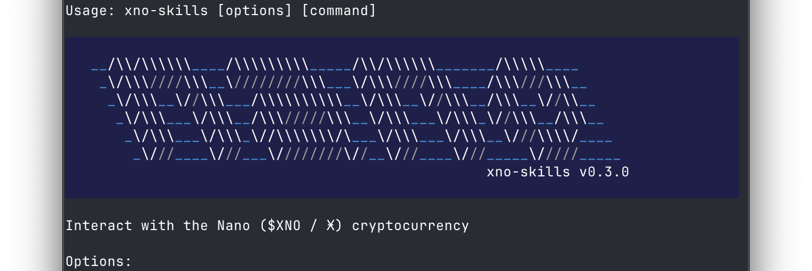

# xno-skills

[](https://www.npmjs.com/package/xno-skills)
[](https://opensource.org/licenses/MIT)
[](https://www.typescriptlang.org/)

A CLI, MCP server, and AI skills for [Nano](https://nano.org/) (XNO). Built on top of [Open Wallet Standard (OWS)](https://github.com/open-wallet-standard/core) for secure key custody.



## AI Skills

Built-in skills for AI agents (Claude Code, Cursor, etc.):

```bash
npx skills add -g CasualSecurityInc/xno-skills
# non-interactively: 
# npx skills add --all -g CasualSecurityInc/xno-skills
```

> [!IMPORTANT]
> If you installed skills from this repository before May 4, 2026, you have 11 individual `nano-*` skills that have been consolidated into a single `nano` skill. Remove the old ones first:
> ```bash
> npx skills remove -g -y nano-block-lattice-expert nano-check-balance nano-convert-units nano-create-wallet nano-generate-qr nano-mcp-wallet nano-request-payment nano-return-funds nano-sign-message nano-validate-address nano-verify-message
> ```
> Then reinstall as above.

Available skills:
- `nano`: Wallet ops, balance, send/receive, QR codes, address validation, unit conversion, payment requests, refunds, block-lattice protocol expertise, and more — all in one skill. Uses `xno-mcp` MCP tools first, falls back to `xno-skills` CLI.

## CLI

```bash
npm install -g xno-skills@2.8.5
xno-skills --help
```

### Wallet Operations

| Command | Description |
|---|---|
| `wallets [options]` | List wallets that have Nano accounts |
| `balance [options]` | Show balance and pending amount |
| `receive [options]` | Receive pending blocks |
| `send [options]` | Send Nano |
| `change-rep [options]` | Submit a change representative block |
| `submit-block [options]` | Sign and submit a prepared block hex |
| `history [options]` | Show transaction history |

### Utilities

| Command | Description |
|---|---|
| `info [options]` | Discover the current state and representative of any Nano account |
| `convert [options] <amount> <from>` | Convert between XNO units |
| `qr [options] <address>` | Generate a QR code for a Nano address |
| `validate [options] <input>` | Validate a Nano address or block hash |

### Cryptography & Signing

| Command | Description |
|---|---|
| `sign [options] <message>` | Sign a NOMS message with a private key |
| `verify [options] <address> <message> <signature>` | Verify a NOMS message signature |

### Advanced & RPC

| Command | Description |
|---|---|
| `rpc` | Query a Nano node RPC |
| `block` | Build unsigned Nano state blocks for manual/expert workflows |

### System

| Command | Description |
|---|---|
| `mcp` | Start the MCP server or view configuration instructions |

All commands support `-j` / `--json` for machine-readable output.

Wallet lifecycle (create, import, rename, delete) is managed by [OWS](https://github.com/open-wallet-standard/core). `xno-skills` bundles OWS as a dependency — no separate install needed. See the [OWS quick-start](https://openwallet.sh/#quickstart) for terminal usage, or install OWS agent skills with `npx skills add open-wallet-standard/core@ows`.

## MCP Server

Exposes Nano wallet functions as tools for AI agents (Claude Desktop, Cursor, Codex, etc.). MCP resources (`xno-wallet://` URIs) are served but require client-side `resources/read` support — not yet available in OpenCode ([#15535](https://github.com/anomalyco/opencode/issues/15535)).

```json
{
  "mcpServers": {
    "nano": {
      "command": "npx",
      "args": ["-y", "-p", "xno-skills@2.8.5", "xno-mcp"]
    }
  }
}
```


### Client Setup Examples

<details>
<summary>Codex</summary>

```bash
codex mcp add nano \
  -c sandbox_mode="danger-full-access" \
  -c 'sandbox_permissions=["network-access"]' \
  -- npx -y -p xno-skills@2.8.5 xno-mcp
```
</details>

<details>
<summary>Claude Desktop (<code>claude_desktop_config.json</code>)</summary>

```json
{
  "mcpServers": {
    "nano": {
      "command": "npx",
      "args": ["-y", "-p", "xno-skills@2.8.5", "xno-mcp"]
    }
  }
}
```
</details>

<details>
<summary>OpenCode (<code>~/.config/opencode/opencode.json</code>)</summary>

```jsonc
{
  "$schema": "https://opencode.ai/config.json",
  "mcp": {
    "nano": {
      "type": "local",
      "command": ["npx", "-y", "-p", "xno-skills@2.8.5", "xno-mcp"],
      "enabled": true
    }
  }
}
```
</details>

<details>
<summary>Gemini CLI (<code>~/.gemini/settings.json</code>)</summary>

```json
{
  "mcpServers": {
    "nano": {
      "command": "npx",
      "args": ["-y", "-p", "xno-skills@2.8.5", "xno-mcp"]
    }
  }
}
```
</details>

<details>
<summary>Antigravity (<code>~/.gemini/antigravity/mcp_config.json</code>)</summary>

```json
{
  "mcpServers": {
    "nano": {
      "command": "npx",
      "args": ["-y", "-p", "xno-skills@2.8.5", "xno-mcp"]
    }
  }
}
```
</details>

<details>
<summary>VS Code (<code>.vscode/mcp.json</code>)</summary>

```json
{
  "servers": {
    "nano": {
      "type": "stdio",
      "command": "npx",
      "args": ["-y", "-p", "xno-skills@2.8.5", "xno-mcp"]
    }
  }
}
```
</details>

## Library

For using `xno-skills` as a TypeScript library, see [LIBRARY.md](./LIBRARY.md).

## Security Notes

- **Never share your seed or private keys.** Anyone with access can fully control your wallet.
- **Store seeds securely.** Use hardware wallets or encrypted storage — never in plain text or version control.
- **Address validation.** Always validate addresses before sending. Nano addresses include checksums.
- **Unit precision.** Nano uses 30 decimal places. Always use string-based conversion to avoid floating-point errors.

## Development

```bash
npm install
npm test
npm run build
```

## Releasing

See `RELEASING.md`.

## Similar Projects

- [kilkelly/nano-currency-mcp-server](https://github.com/kilkelly/nano-currency-mcp-server) — MCP server for Nano with a simple per-transaction send limit
- [strawberry-labs/berrypay-cli](https://github.com/strawberry-labs/berrypay-cli) — Nano wallet CLI for AI agents with payment processing and auto-sweep

## License

MIT
